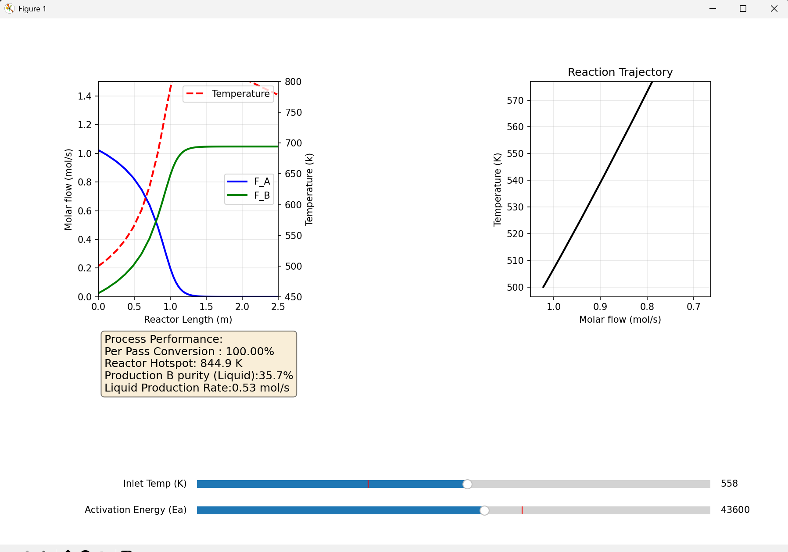

# PFR Model with Recycle & Flash Separation


A robust, equation-oriented simulation of a Plug Flow Reactor (PFR) integrated with a flash separation unit and a recycle loop.

This project solves the coupled non-linear system of differential-algebraic equations (DAEs) that arise when connecting a kinetic reactor model with a thermodynamic flash separator. It includes an interactive dashboard to visualize the process dynamics and reactor stability.

## 📸 Interactive Dashboard


*Figure 1: Real-time simulation showing reactor temperature profiles (left), phase plot (right), and interactive sliders for Inlet Temperature and Activation Energy.*

## 🚀 Key Features

* **Equation-Oriented Solver:** Solves the entire flowsheet (Reactor + Flash + Recycle + Mixer) simultaneously using `scipy.optimize.least_squares`.
* **Rigorous PFR Model:** Uses `scipy.integrate.solve_ivp` to integrate mass, energy, and momentum balances along the reactor length.
* **Flash Separation:** Implements Rachford-Rice and equilibrium constants to model vapor-liquid equilibrium.
* **Interactive Simulation:** Real-time dashboard to explore the sensitivity of the system to **Inlet Temperature** and **Activation Energy (Ea)**.

## 🧠 The "Smart" Slider Logic (Handling Hysteresis)

One of the biggest challenges in simulating non-linear reactors with recycle loops is **Multiple Steady States**. The system often has two mathematical solutions:
1.  **Extinguished Branch:** Low temperature, near-zero conversion.
2.  **Ignited Branch:** High temperature, high conversion.

### The Problem
Standard solvers are "lazy" they use the previous solution as the initial guess for the next step. If you start with a cold reactor and slowly heat it up, the solver gets "stuck" on the extinguished branch, even when the reactor *should* ignite.

### The Solution: "Biased Guessing"
To make the interactive slider feel physically accurate and responsive, I implemented a **Biased Guess strategy** in the solver loop.

Instead of strictly using the previous state (memory), the update loop forces a "Hot Kick" to the temperature variable before solving:

```python
# From src/pfr_model/visualization/interactive_plots.py

# 1. Copy previous flow rates to maintain smoothness
guess = state["current_sol"].copy()

# 2. FORCE the solver to look for an ignited state
# We override the temperature guess to be at least 600 K.
guess[8] = max(guess[8], 600.0)
```

Why this works: By forcing the solver to start its search from a high-temperature guess (600K), we ensure that if an Ignited State exists, the solver will find it immediately. This allows the simulation to snap correctly between extinguished and ignited states without manual resetting, providing a smooth user experience.

### 📂 Project Structure
The project is organized as a proper Python package for modularity and testing.

```
src/pfr_model/
├── config/
│   └── parameters.py       # Global physical constants (R, Cp, Enthalpy) and default inputs
├── kinetics/
│   └── arrhenius.py        # Reaction rate laws (k = A * exp(-Ea/RT))
├── reactor/
│   ├── pfr_model_equation.py  # Defines the ODEs (dF/dz, dT/dz, dP/dz)
│   └── pfr_solver.py          # Wrapper for the ODE integrator
├── separation/
│   └── flash.py            # Equation-oriented Flash unit model
├── flowsheet/
│   └── residuals.py        # The "Brain" of the operation. Connects all units and calculates residuals.
├── visualization/
│   └── interactive_plots.py   # Matplotlib GUI with slider logic
└── scripts/
    └── run_interactive.py     # Entry point to launch the app
```


### 🛠️ Installation
Clone the repository and install it in editable mode:

```bash
git clone [https://github.com/Asaisidharth/PFR-model-recycle.git](https://github.com/Asaisidharth/PFR-model-recycle.git)
cd PFR-model-recycle
pip install -e .
```

### 🖥️ Usage
To launch the interactive simulation dashboard:

```bash
python -m pfr_model.scripts.run_interactive
```

### 🔬 Mathematical Model
The system solves for a vector of 11 unknowns simultaneously:

Recycle Streams: F_A_rec, F_B_rec

Flash Split: F_A_vapor, F_B_vapor, F_A_liquid, F_B_liquid

Reactor Inlet: F_A_in, F_B_in

Reactor Outlet: F_A_out, F_B_out, T_outs

The residuals are calculated by closing the mass and energy balances across the mixer, the integrated PFR path, and the flash unit.

### 📄 License
This project is licensed under the MIT License - see the LICENSE file for details.